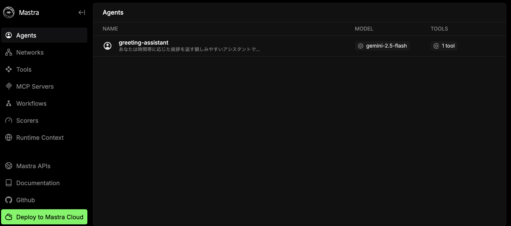
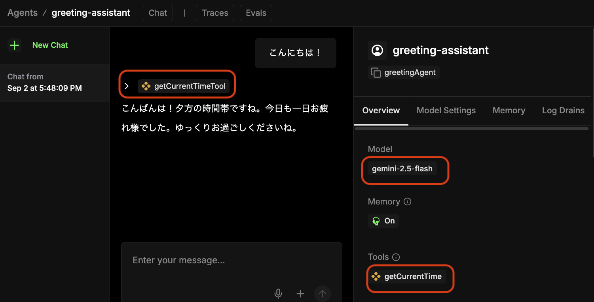
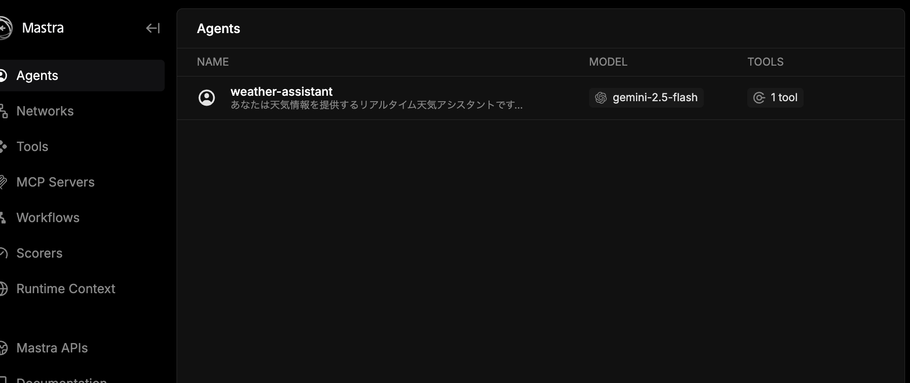
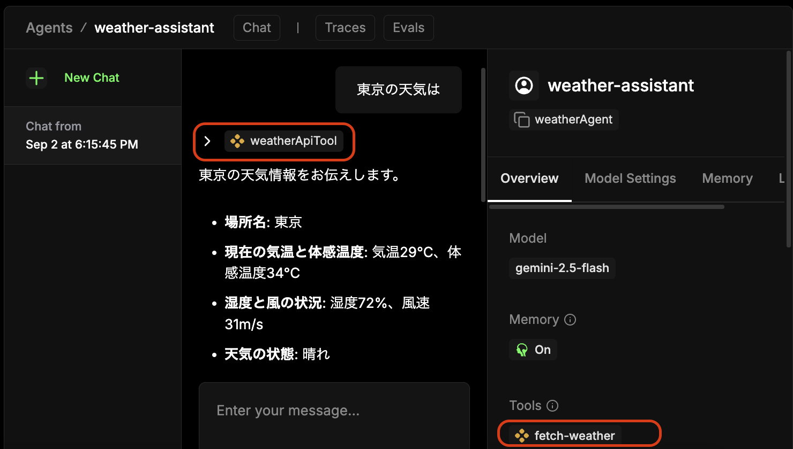

<style>
  section {
    font-size: 26px;
  }
</style>

# AIエージェントを作ろう!
## Mastraを使ったAIエージェント作成

**2025年09月11日（木）**
**株式会社ネクストビート**

---

## 本日のアジェンダ

1. **イントロダクション**
   - AIエージェントとMastraフレームワーク
2. **環境構築**
   - リポジトリのクローンと動作確認
3. **挨拶エージェント**
   - 動作確認と解説、カスタマイズ
4. **お天気情報エージェント**
   - 動作確認と解説、カスタマイズ
5. **まとめ**
   - 質疑応答とネクストステップ

---

## 1. イントロダクション

---

### 自己紹介

- **名前**: 水島宏太（みずしま こうた）
  - ネットでは[@kmizu](https://x.com/kmizu)として活動しています
- **所属**: 株式会社ネクストビート
  - テクノロジーエヴァンジェリスト
- **今日伝えたいこと**:
  - AIエージェント開発の楽しさと可能性
  - Mastraを使った開発の第一歩を踏み出すサポート

---

### AIエージェントとは？

**自律的にタスクを実行するAIプログラム**

- **ゴール**を与えると、自ら**計画**を立てる
- 必要な**ツール**（Web検索、計算など）を使いこなす
- **状況を判断**し、ゴール達成まで自律的に動作する

Mastraは、このようなAIエージェントを効率的に開発するためのフレームワークです。

---

### Mastraフレームワークの紹介

**TypeScript製のAIエージェント開発フレームワーク**
URL: https://mastra.ai/

- **特徴**
  - **ツールの統合**: 外部APIや自作関数を簡単にエージェントの「ツール」として追加可能
  - **ワークフロー**: 複雑なタスクの実行フローを定義・自動化
  - **開発体験**: プレイグラウンドやデバッグ機能が充実

Web開発者にとって馴染み深いTypeScriptで、パワフルなAIエージェントを構築できます。

---

### 本ハンズオンのゴール

- Mastraを使ったAIエージェント開発の**基本的な流れ**を理解する。
- 自律的にタスクを実行する**AIエージェントを実際に動かし**、その可能性を体感する。
- 既存のエージェントを改造し、**ツール**と**エージェント**の役割を理解する。

手を動かしながら、AIエージェント開発の第一歩を踏み出しましょう！

---

## 2. 環境構築

---

### 必要なもの

- **Node.js (v22以上)**
  - ターミナルで `node -v` を実行してバージョンを確認
- **テキストエディタ**
  - VS Codeを推奨します
- **Gemini APIキー**
  - [Google AI Studio](https://ai.googlei.com/studio) で取得
    - 無料でGemini APIを使える
    - データは学習されるので、機密情報は避けること

準備がまだの方は、この時間でセットアップをお願いします。

---

### 1. プロジェクトの準備

作業用のリポジトリをcloneしましょう。

```bash
git clone https://github.com/nextbeat-dev/nextbeat-tech-event.git
cd ai-agent-hands-on # 今回のイベント用ディレクトリに移動
```

---

### 2. 挨拶エージェントのディレクトリに移動

```bash
pwd # .../nextbeat-tech-event/ai-agent-hands-on
cd greeting-agent
```

時間に応じた挨拶を返すだけのシンプルなエージェントが入っています。

---

### 4. APIキーの設定

プロジェクトのルートに `.env` ファイルを作成し、GeminiのAPIキーを記述します。
**このファイルはGitなどで公開しないように注意してください。**

**.env**

```bash
GEMINI_API_KEY="..."
```

Mastraは自動でこのファイルを読み込んでくれます。

---

### 5. 起動

`npm i`で依存関係をインストールして、`npm run dev`でエージェントを起動してみましょう。
ターミナルで以下のコマンドを実行します。

```bash
npm i
npm run dev
```

Mastraサーバーの起動に成功したら、以下のようなメッセージが表示されます。

```bash
$ npm run dev

> greeting-agent@1.0.0 dev
> mastra dev

INFO [2025-09-03 09:13:08.390 +0900] (Mastra CLI): Starting watcher...
INFO [2025-09-03 09:13:08.895 +0900] (Mastra CLI): Bundling finished, starting server...
INFO [2025-09-03 09:13:08.927 +0900] (Mastra CLI): [Mastra Dev] - Starting server...
INFO [2025-09-03 09:13:09.641 +0900] (Mastra):  Mastra API running on port http://localhost:4112/api
INFO [2025-09-03 09:13:09.644 +0900] (Mastra): 👨‍💻 Playground available at http://localhost:4112
```

---

### 6. 動作確認（１）

ブラウザで`http://localhost:4112`（Playground）にアクセスします。以下のような画面が表示されるはずです。



---

### 6. 動作確認（２）

挨拶を入力すると以下のように返答が返ってきます。
- `getCurrentTime`が現在時刻を返すToolです。



---

## 3. Mastraの基本

---

### Mastraの主要コンセプト

Mastraは主に3つの要素で構成されます。

1. **Tool（ツール）**
   - エージェントが利用できる具体的な「能力」。
   - 例: `Web検索する`, `計算する`, `メールを送る`
   - 先ほどの`getCurrentTime`もツールの一例です。

2. **Agent（エージェント）**
   - `Tool`を使いこなし、与えられた指示を実行する思考エンジン。
   - プロンプトを書き込むことでエージェントの振る舞いをカスタマイズできます。

3. **Workflow（ワークフロー）**
   - `Agent`と`Tool`を組み合わせて、一連のタスクフローを定義します。
   - ユーザーからの入力を受け付け、最終的な結果を出力するまでの流れを管理します（今回は使いません）

---

### 挨拶エージェントを改造してみよう

`src/mastra/tools/time-tool.ts`を書き換えて、挨拶メッセージをカスタマイズしてみましょう。

```ts
    if (hour >= 5 && hour < 11) {
      timeOfDay = '朝';
      greetingMessage = 'おはようございます！今日も素敵な一日になりますように。朝の爽やかな時間帯ですね。';
    } else if (hour >= 11 && hour < 17) {
      timeOfDay = '昼';
      greetingMessage = 'こんにちは！お昼の時間帯ですね。調子はいかがですか？';
    } else if (hour >= 17 && hour < 21) {
      timeOfDay = '夕方';
      greetingMessage = 'こんばんは！夕方の時間帯ですね。今日も一日お疲れ様でした。';
    } else {
      timeOfDay = '夜';
      greetingMessage = 'こんばんは！夜遅い時間ですね。ゆっくりお休みくださいね。';
    }
```

この部分を書き換えることで、時間帯を細かく区切ったり、挨拶メッセージを変更できます。

---

### サーバーの再起動

書き換えたら、サーバーを再起動しましょう。

```bash
npm run dev
```

先ほどと同様に、ブラウザで`http://localhost:4112`にアクセスし、挨拶を入力してみましょう。
うまく動作すれば、カスタマイズした挨拶が返ってくるはずです。

---

### コードの解説 (1/2) - Tool

```ts
export const getCurrentTimeTool = createTool({
  // ツールの一意なID
  id: 'getCurrentTime',
  description: '現在の日本時間を取得して、時間帯に応じた挨拶メッセージを生成します',
  // 入力スキーマ（今回は空）
  inputSchema: z.object({}),
  // 出力スキーマ（以下の全てのフィールドが必須）
  outputSchema: z.object({
    currentTime: z.string(),
    hour: z.number(),
    timeOfDay: z.string(),
    greetingMessage: z.string(),
  }),
  execute: async () => {
    const now = new Date();
    ...
  },
})
```

`createTool`関数によって、処理をAIエージェントが理解できる「ツール」に変換します

---

### コードの解説 (2/2) - Agent

```ts
export const greetingAgent = new Agent({
  name: 'greeting-assistant',
  instructions: `あなたは時間帯に応じた挨拶を返す親しみやすいアシスタントです。

  ## 重要な指示
  （中略）
  - 時間帯に合った気遣いの言葉を添える`,
  model: google('gemini-2.5-flash', {
    apiKey: process.env.GEMINI_API_KEY,
  }),
  tools: {
    getCurrentTimeTool,
  },
  // ...
});
```

- `Agent`は思考を担当します。
- どの`tool`をどの引数で呼び出すかを、`instructions`と`tools`をヒントにLLMが判断します。

---

## 4. お天気情報エージェント

---

### 1. お天気情報エージェントのディレクトリに移動

```bash
pwd # .../ai-agent-hands-on/greeting-agent
cd ../weather-agent
```

Open-Meteoを使って天気情報を調べるためのエージェントが入っています。

---

### 2. APIキーの設定

先ほどと同様に`.env` ファイルを作成し、GeminiのAPIキーを記述します。
**このファイルはGitなどで公開しないように注意してください。**

**.env**

```bash
GEMINI_API_KEY="..."
```
---

### 3. 起動

`npm i`で依存関係をインストールして、`npm run dev`でエージェントを起動してみましょう。
ターミナルで以下のコマンドを実行します。

```bash
npm i
npm run dev
```

Mastraサーバーの起動に成功したら、以下のようなメッセージが表示されます。

```bash
$ npm run dev
> weather-agent@1.0.0 dev
> mastra dev

INFO [2025-09-02 18:11:16.594 +0900] (Mastra CLI): Starting watcher...
INFO [2025-09-02 18:11:17.168 +0900] (Mastra CLI): Bundling finished, starting server...
INFO [2025-09-02 18:11:17.201 +0900] (Mastra CLI): [Mastra Dev] - Starting server...
INFO [2025-09-02 18:11:18.020 +0900] (Mastra):  Mastra API running on port http://localhost:4112/api
INFO [2025-09-02 18:11:18.022 +0900] (Mastra): 👨‍💻 Playground available at http://localhost:4112
```

---

### 4. 動作確認（１）

ブラウザでPlayground（`http://localhost:4112`）にアクセスします。以下のような画面が表示されるはずです。



---

### 5. 動作確認（２）

天気を聞くメッセージを入力すると以下のように返答が返ってきます。
- `fetch-weather`が天気情報を返すToolです



---

### お天気情報エージェントを改造してみよう

`src/mastra/tools/weather-api-tools.ts`を書き換えてみましょう。

以下のプロンプトを書き換えて、天気に関する情報に加えて、おすすめの服装についても答えてもらうようにしてみましょう。

```
  instructions: `あなたは天気情報を提供するリアルタイム天気アシスタントです。

  ## 【絶対的な指示】
  天気に関する質問を受けたら、必ずweatherApiToolを実行してください。例外はありません。
  
  ステップ：
  1. まずweatherApiToolを呼び出す
  2. ツールの結果を基に回答する

　（中略）
  
  親しみやすく、実用的で安全に配慮した情報を提供してください。`,
```

---

### サーバーの再起動

書き換えたら、サーバーを再起動しましょう。

```bash
npm run dev
```

ブラウザで`http://localhost:4112`にアクセスし、天気を聞いてみましょう。
うまく動作すれば、おすすめの服装についても答えてくれるはずです。

---

### ハンズオン：さらにスタマイズしてみよう！

いくつかカスタマイズのアイデアを提案します。ぜひ挑戦してみてください。

- **アイデア1: 新しいツールを追加する**
  - `getLuckyColor` のような、今日のラッキーカラーを返すツールを追加し、提案に含めてもらう。

- **アイデア2: プロンプトを修正する**
  - エージェントの性格を変えてみる（例：ギャル風、執事風）。
  - `weatherAgent` の `prompt` を修正してみましょう。

---

## 5. まとめ

---

### 発展的なトピック

Mastraには、今日紹介した機能以外にも高度な機能があります。

- **Memory (メモリ)**
  - 過去の対話履歴を記憶し、文脈に沿った応答を可能にする機能。チャットボットなどで活躍します。
  - 実は既に使っていました

- **Playground (プレイグラウンド)**
  - Web UI上でエージェントの動作をインタラクティブにテスト・デバッグできる開発ツール。
  - 実は既に使っていました

- **RAG (Retrieval-Augmented Generation)**
  - 外部のドキュメントやデータベースの情報を検索し、その内容に基づいて回答を生成する仕組み。社内文書に基づいたQAボットなどが作れます。

---

### 参考資料とネクストステップ

- **Mastra 公式ドキュメント**
  - `https://mastra.ai/ja/docs`
  - 全ての機能について詳細な解説があります。

- **Mastra GitHubリポジトリ**
  - [https://github.com/mastra-ai/mastra](https://github.com/mastra-ai/mastra)
  - サンプルコードや最新の動向はこちらで。

- **今日作ったコードを発展させる**
  - 天気情報APIの代わりに検索APIなどに置き換えてみましょう。

---

## 質疑応答

---

ご清聴ありがとうございました！

アンケートのお願い：5分程度で終わりますので、ご協力をお願いします。

- アンケートURL: https://forms.gle/N6YAQ8uexWF4hbcE8


---

# 懇親会のご案内

MetaLifeにて懇親会を開催します。ぜひご参加ください！

URL: [https://app.metalife.co.jp/spaces/g4T21SGqt0CtxaOJDOw7](https://app.metalife.co.jp/spaces/g4T21SGqt0CtxaOJDOw7)

