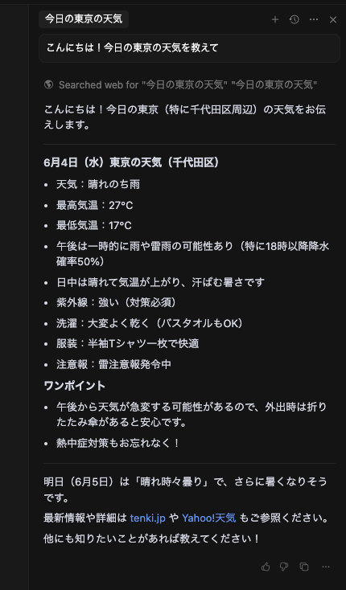
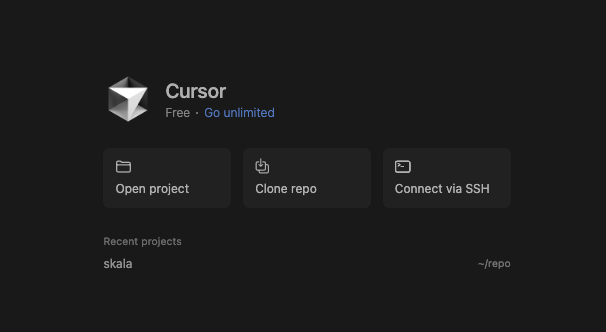

<style>
  section {
    font-size: 28px;
  }
</style>

#  Cursorを使ったAIコーディング体験会 in 東京
## ～AIとのペアプログラミングを体験しよう～

**2025年06月19日（木）**
**株式会社ネクストビート**

---

## 本日の流れ (18:30 - 20:00)

| 時間        | 内容                                          |
| ----------- | --------------------------------------------- |
| 18:30-18:40 | 会社紹介                                      |
| 18:40-18:50 | **講義：生成AI・AIエージェント・Cursor入門**  |
| 18:50-19:00 | **Cursor 環境設定・基本操作**                 | 
| 19:00-19:20 | **演習1：簡易タスクリストアプリ with Cursor** |
| 19:20-19:30 | 休憩                                          |
| 19:30-19:50 | **演習2：簡易メモアプリ with Cursor**         |
| 19:50-20:00 | まとめ・質疑応答                              |

---

## 第1部：講義 (18:40 - 18:50)
### 生成AI・AIエージェント・Cursor入門

---

### 1. AIコーディングの波 🌊

* LLM (大規模言語モデル) の進化により、AIがコードを生成・理解・編集する時代へ。
* ソフトウェア開発の生産性向上、新しい働き方を実現する可能性。
* **Cursor** のようなツールを使いこなし、AIを開発のパートナーに！

---

### 2. 生成AIとAIエージェント 🤖

* **生成AI (Generative AI):** 新しいコンテンツ (テキスト, 画像, **コード**) を生成するAI。
* **AIエージェント (AI Agent):** 自律的にタスクを実行するAI。コーディング支援も高度化。
    * 例: Cursor, GitHub Copilot (支援型) 〜 Devin (自律型)

---

### 3. Cursorとは？ ✨ AIファーストなコードエディタ

* VS Codeベースで馴染みやすいインターフェース。
* **AIとの対話 (`Ctrl+L` / `Cmd+L`)** や **インライン指示 (`Ctrl+K` / `Cmd+K`)** でコーディングを加速。
* コード生成、リファクタリング、デバッグ、ドキュメント作成などをAIがサポート。
* **無料版**でも強力な機能を体験可能！


---

## 第2部：Cursor 環境設定・基本操作 (18:50 - 19:00)

---

### Cursorの準備はOK？

* お手元のPCに **Cursor** はインストール済みですか？
    * 最初の起動まで済ませておいてください。
* Wi-Fi接続を確認してください (ゲストWi-Fiあり)。
* 困ったら遠慮なくスタッフに声をかけてください！

---

### 基本的な使い方 (おさらい)

* **AIチャットを開く/閉じる:**
    * Windows: `Ctrl + L`
    * Mac: `Cmd + L`
* **選択範囲やカーソル位置でAIに指示 (インライン編集/生成):**
    * Windows: `Ctrl + K`
    * Mac: `Cmd + K`

試しにチャットでAIに「`こんにちは！今日の東京の天気を教えて`」と話しかけてみましょう。

---

### Cursorに質問した結果

- 回答は毎回変わります

<center>

</center>

---

### リポジトリをクローンする

**GitHubリポジトリ`mini-app`をクローンして、演習用のコードベースを準備します

```bash
git clone https://github.com/nextbeat-dev/mini-app.git
```

1. 「Open project」をクリック
2. クローンした`mini-app`フォルダを選択




---

## 第3部：演習1 (19:00 - 19:20)
### 簡易タスクリストアプリ with Cursor (JavaScript)

---

### 演習1：目標

**HTML、CSS、JavaScriptを使ったシンプルなタスクリストアプリをCursorと一緒に作ってみましょう！**

* **機能要件：**
    1.  タスクを入力できるフォームがある。
    2.  入力されたタスクがリスト表示される。
    3.  タスクを完了状態にできる (打ち消し線など)。
    4.  タスクを削除できる。

---

### 演習1：プロンプト例（HTML作成）

**HTMLの骨組み作成**

- `index.html` ファイルを作成。
- Cursorにチャットで依頼:

```
簡単なタスクリストアプリのHTML構造を考えてください。
入力フィールド、追加ボタン、タスク一覧表示エリアが必要です。
 ```

---

### 演習1：プロンプト例（.jsファイル作成）

**基本的なJavaScriptのロジック (タスク追加と表示)を作成**

- `script.js` ファイルを作成し、HTMLから読み込む。
- Cursorにチャットやインライン編集で依頼:

```
(HTMLの要素を指定しつつ)
入力されたテキストをタスクとしてリストに追加し、表示するJavaScriptを書いて。
```

---

### 演習1：プロンプト例 (タスクの完了・削除機能)

- Cursorに機能追加を依頼:

```
タスクに完了チェックボックスを付けて、チェックされたら打ち消し線を入れるようにして。
各タスクに削除ボタンも付けて、クリックしたらそのタスクを削除できるようにして。
```

---


### 演習1：プロンプト例 (CSSでスタイリング)

- `style.css` ファイルを作成し、HTMLから読み込む。
- Cursorにデザインを依頼:

```
このタスクリストアプリをもう少し見やすくスタイリングしてください。
モダンでシンプルな感じで。
```

**ヒント：** 生成されたコードが期待通りでなければ、AIに修正を依頼したり、自分で少し手直ししてみましょう！

---

## 休憩 (19:20 - 19:30)

☕️ ごゆっくりどうぞ！

---

## 演習2 (19:30 - 19:50)
### 簡易メモアプリ with Cursor (JavaScript)

---

### 演習2：目標

**演習1を応用して、Markdown形式で入力できる簡易メモアプリを作成しましょう！**

* **機能要件：**

1.  テキストエリアにMarkdown形式でメモを入力できる。
2.  入力されたメモをリアルタイム (またはボタンで) プレビューできる。
3.  メモをローカルストレージに保存できる。
4.  保存されたメモを読み込める。

---

### 演習2：プロンプト例（HTMLと基本JS構造）

- 新しいファイル (例: `memo.html`, `memo.js`, `memo.css`) を準備。
- Cursorに依頼:

```
Markdown対応の簡易メモアプリを作りたい。
左側にテキスト入力エリア、右側にプレビューエリアがあるHTML構造と、
基本的なJavaScriptの雛形をください。
```

---

### 演習2：プロンプト例（Markdownプレビュー機能）

- プレビュー機能の実装を依頼
- 外部ライブラリ (例: Marked.js) の利用も検討。

```
テキストエリアに入力されたMarkdownをリアルタイムでプレビューする機能を追加して。
必要ならMarked.jsなどのライブラリを使ってください。CDN経由でOK。
```

---

### 演習2：ステップ・プロンプト例 (ローカルストレージの利用)

- ローカルストレージへの保存と読み込み機能を追加
- Cursorに機能追加を依頼:

```
メモの内容をブラウザのローカルストレージに保存する機能と、
ページ読み込み時に保存されたメモを読み込む機能を追加してください。
```

---

### 演習2：ステップ・プロンプト例 (UI改善や機能追加)

- Cursorに相談しながら改善:

```
保存ボタンや新規作成ボタンを追加したい。
プレビューエリアのデザインを調整してほしい。
```

**ポイント：** Cursorに「既存のコードをリファクタリングして」や「この関数の意味を教えて」と頼むのも有効です！

---

## 第5部：まとめ・質疑応答 (19:50 - 20:00)

---

### 本日のまとめ

* AIコーディングツール **Cursor** の基本的な使い方を体験しました。
* AIとの対話を通じて、簡単なWebアプリケーションを作成しました。
    * プロンプトによるコード生成
    * 既存コードの編集、機能追加
* AIは開発の強力な **アシスタント** になり得ます。
    * 定型作業の自動化、アイデアの壁打ち、新しい技術の学習など。

**今後の開発にもAIツールを積極的に活用してみてください！**

---

### 質疑応答 💬

イベントに関するご質問、CursorやAIコーディングに関するご質問など、どうぞ！

---

### 懇親会のご案内

- **20:00から9Fにて懇親会**を開催します！ (任意参加)。

**本日はご参加いただき、ありがとうございました！**

**アンケートにご協力ください (もしあればQRコードなど)**
