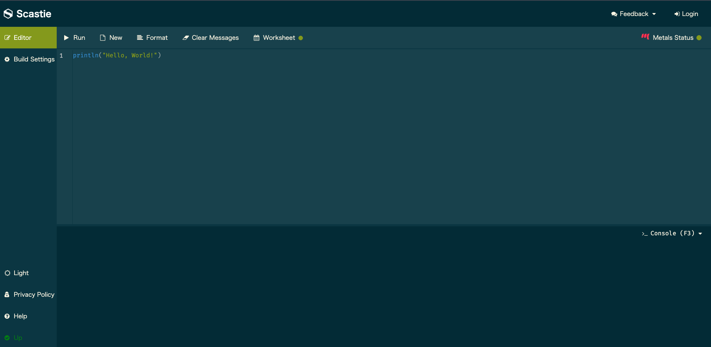
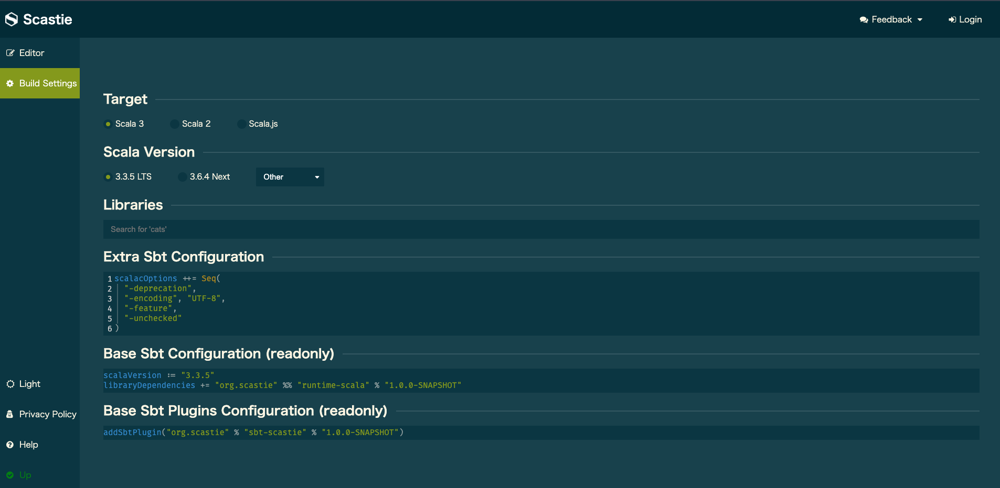

<style>
  section {
    font-size: 30px;
  }
</style>

## ゼロから始めるScala体験会 - 補足資料

* この資料ではScastieとScalaの基本的な使い方を紹介します。
* 補足資料としてご活用ください

---

## Scastieについて

* ブラウザでScalaコードを書いて、すぐに実行できる便利なツールです。
  * https://scastie.scala-lang.org/

* **簡単な使い方:**
  1.  左側のエディターにコードを入力
  2.  「Run」ボタンをクリック
  3.  右側に出力結果が表示される
  4.  **重要:** 左上の `Build Settings` -> `Scala Version` が **3系** (例: 3.3.3) になっていることを確認してください。

---

## Scastieの画面 - Editor



---

## Scastieの画面 - Build Settings



---

## Scalaでの関数の定義

Scalaでの基本的な関数の書き方です。

```scala
// def 関数名（引数名: 引数の型）: 戻り値の型 = { 処理 }
// s"..." は文字列補間（String Interpolation）
def greet(name: String): String = s"Hello, $name!"
// 関数呼び出し
println(greet("Scala")) // 出力: Hello, Scala!
```

* **ポイント:**
  * `def` キーワードで関数を定義
    * 引数と戻り値の **型** を指定
    * 返り値は省略可能だが明記推奨
  * `=` の後に関数の本体を書く

---

## Scalaでのクラス定義

クラスはオブジェクトの設計図です。`class` キーワードで定義します。

```scala
// Person クラスを定義
class Person(name: String, age: Int) {
  // メソッドを定義
  def introduce(): String = s"My name is $name, $age years old."
}
// クラスからインスタンス（オブジェクト）を作成
val person = Person("Alice", 30)
// メソッドを呼び出す
println(person.introduce()) // 出力: My name is Alice, 30 years old.
```

* **ポイント:**
  * `class` キーワードでクラスを定義
  * `クラス名(...)` キーワードでインスタンスを作成

---

## Scalaでのオブジェクト定義

`object` キーワードで定義されるオブジェクトは、その定義自体が唯一のインスタンス（シングルトンオブジェクト）になります。

```scala
// Utils オブジェクトを定義
object Utils {
  val PI: Double = 3.14159
  def double(x: Int): Int = x * 2
}
// オブジェクト名で直接メンバーにアクセス
println(Utils.PI)       // 出力: 3.14159
println(Utils.double(5)) // 出力: 10
```

* **ポイント:**
  * `object` キーワードでシングルトンオブジェクトを定義
  * 静的メソッドや定数をまとめるのによく使われる

---

## 成功 or 失敗 を表す型: `Either`

結果が **成功** か **失敗** のどちらか一方であることを **型** で表現します。

* `Either[L, R]` という型
    * `L`: Left（左側）の型。慣習的に **失敗** 時の情報を入れる
      - 例: エラーメッセージ `String`
    * `R`: Right（右側）の型。慣習的に **成功** 時の値を入れる 
      - 例: 正常な値 `Int`

---

## 成功 or 失敗 を表す型: `Either`（コード例）

```scala
// 成功例: Right を使う。Int型の値 100 を持つ
val success: Either[String, Int] = Right(100)
// 失敗例: Left を使う。String型の "エラー発生" を持つ
val failure: Either[String, Int] = Left("エラー発生")
println(success) // 出力: Right(100)
println(failure) // 出力: Left(エラー発生)
```

---

## `Either` の中身を取り出す (`match`)

`match` 式を使って、`Right`（成功）か `Left`（失敗）かで処理を分岐できます。

```scala
val success: Either[String, Int] = Right(100)
val failure: Either[String, Int] = Left("エラー発生")
success match {
  case Right(value) => println(s"成功しました！ 値: $value") // こちらが実行される
  case Left(error)  => println(s"失敗しました… 理由: $error")
} // 出力: 成功しました！ 値: 100
failure match {
  case Right(value) => println(s"成功しました！ 値: $value")
  case Left(error)  => println(s"失敗しました… 理由: $error") // こちらが実行される
} // 出力: 失敗しました… 理由: エラー発生

---
