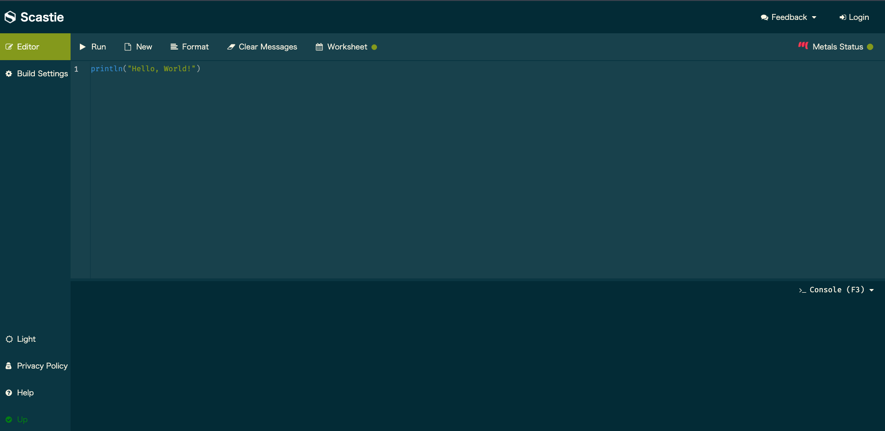
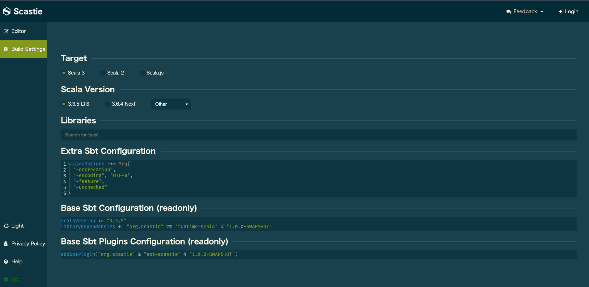

<style>
  section {
    font-size: 28px;
  }
</style>

## ゼロから始めるScala体験会 - 補足資料

* この資料ではScastieとScalaの基本的な使い方を紹介します。
* 補足資料としてご活用ください

---

## Scastieについて

* ブラウザでScalaコードを書いて、すぐに実行できる便利なツールです。
  * https://scastie.scala-lang.org/

* **簡単な使い方:**
  1.  左側のエディターにコードを入力
  2.  「Run」ボタンをクリック
  3.  右側に出力結果が表示される
  4.  **重要:** 左上の `Build Settings` -> `Scala Version` が **3系** (例: 3.3.3) になっていることを確認してください。

---

## Scastieの画面 - Editor



---

## Scastieの画面 - Build Settings



---

## Scalaの基本構文: val と var

Scalaで変数を定義するには `val` または `var` を使います。

```scala
// val: 再代入不可能な変数 (immutable)
val message: String = "Hello"
// message = "World" // コンパイルエラー！ valは再代入できません

// var: 再代入可能な変数 (mutable)
var count: Int = 0
count = 1 // varは再代入できます
println(count) // 出力: 1

// 型推論: 型を省略することも可能
val greeting = "Hi" // greeting は String 型と推論される
var total = 100     // total は Int 型と推論される
```

- `val` は一度値を代入したら変更できません（推奨）。
- `var` は値を後から変更できます。

---

## Scalaの基本構文: データ型

Scalaは静的型付け言語なので、変数や式には型があります。

```scala
// 数値型
val intValue: Int = 10       // 整数
val doubleValue: Double = 3.14   // 浮動小数点数
// 真偽値型
val booleanValue: Boolean = true // 真偽値 (true または false)
// 文字・文字列型
val charValue: Char = 'A'      // 1文字
val stringValue: String = "Hello, Scala" // 文字列
// Unit型: 戻り値がないことを示す (Javaのvoidに相当)
def sayHello(): Unit = println("Hello!")
```

-  Scalaのデータ型はオブジェクトです（プリミティブ型もオブジェクトです）。
-  `Unit` 型は、関数が何も値を返さない場合に使われます（`void`相当）。

---

## Scalaの基本構文: if 式

条件によって処理を分岐させるには `if` 式を使います。Scalaの `if` は式なので、値を返すことができます。

```scala
val x = 10

val result = if (x > 5) {
  "xは5より大きい"
} else {
  "xは5以下"
}

println(result) // 出力: xは5より大きい
```

-  `if (条件) { ... } else { ... }` の形式で書きます。
-  `if` 式全体が評価結果の値を返します。

---

## Scalaの基本構文: while ループ

条件が満たされている間、処理を繰り返すには `while` ループを使います。

```scala
var i = 0
while (i < 5) {
  println(s"Count: $i")
  i += 1 // 変数の値を更新
}
// 出力:
// Count: 0
// Count: 1
// Count: 2
// Count: 3
```

-  `while (条件) { ... }` の形式で書きます。
-  条件が `true` の間、ブロック内の処理が繰り返されます。

---

## Scalaの基本構文: for 式

繰り返し処理やコレクションの操作には `for` 式がよく使われます。様々な形式がありますが、ここでは基本的な使い方を紹介します。

```scala
// 1から5までを出力
for (i <- 1 to 5) {
  println(i)
}
// リストの要素を出力
val fruits = List("Apple", "Banana", "Cherry")
for (fruit <- fruits) {
  println(fruit)
}
// 値を生成 (yield)
val doubledNumbers = for (number <- 1 to 5) yield number * 2
println(doubledNumbers) // 出力: Vector(2, 4, 6, 8, 10)
```

- `for (変数 <- コレクションまたは範囲)` の形式で書きます。
- `yield` を使うと、新しいコレクションを生成できます。

---

## Scalaでの関数の定義

Scalaでの基本的な関数の書き方です。

```scala
// def 関数名（引数名: 引数の型）: 戻り値の型 = { 処理 }
// s"..." は文字列補間（String Interpolation）
def greet(name: String): String = s"Hello, $name!"
// 関数呼び出し
println(greet("Scala")) // 出力: Hello, Scala!
```

- `def` キーワードで関数を定義
 - 引数と戻り値の **型** を指定
 - 返り値は省略可能だが明記推奨
- `=` の後に関数の本体を書く

---

## Scalaの基本構文: コレクション

複数の要素を扱うための便利なデータ構造がコレクションです。代表的なものを紹介します。

```scala
// List: 不変な連結リスト (要素の追加・削除で新しいリストが生成される)
val numbers: List[Int] = List(1, 2, 3, 4, 5)
println(numbers.head) // 出力: 1 (最初の要素)
println(numbers.tail) // 出力: List(2, 3, 4, 5) (最初の要素以外)

// Seq: シーケンス (順序を持つコレクションの総称)
val sequence: Seq[String] = Seq("A", "B", "C")
println(sequence(1)) // 出力: B (インデックス指定でアクセス)

// Map: キーと値のペアのコレクション (不変)
val colors: Map[String, String] = Map("red" -> "#FF0000", "blue" -> "#0000FF")
println(colors("red")) // 出力: #FF0000
```

- Scalaの標準コレクションは、ほとんどが **不変 (immutable)** です。
- `List`, `Seq`, `Vector`, `Map`, `Set` など、用途に応じた様々なコレクションがあります。

---

## Scalaでのクラス定義

クラスはオブジェクトの設計図です。`class` キーワードで定義します。

```scala
// Person クラスを定義
class Person(name: String, age: Int) {
  // メソッドを定義
  def introduce(): String = s"My name is $name, $age years old."
}
// クラスからインスタンス（オブジェクト）を作成
val person = Person("Alice", 30)
// メソッドを呼び出す
println(person.introduce()) // 出力: My name is Alice, 30 years old.
```

- `class` キーワードでクラスを定義
- `クラス名(...)` キーワードでインスタンスを作成

---

## Scalaでのオブジェクト定義

`object` キーワードで定義されるオブジェクトは、その定義自体が唯一のインスタンス（シングルトンオブジェクト）になります。

```scala
// Utils オブジェクトを定義
object Utils {
  val PI: Double = 3.14159
  def double(x: Int): Int = x * 2
}
// オブジェクト名で直接メンバーにアクセス
println(Utils.PI)       // 出力: 3.14159
println(Utils.double(5)) // 出力: 10
```

- `object` キーワードでシングルトンオブジェクトを定義
- 静的メソッドや定数をまとめるのによく使われる

---

## 成功 or 失敗 を表す型: `Either`

結果が **成功** か **失敗** のどちらか一方であることを **型** で表現します。

* `Either[L, R]` という型
    * `L`: Left（左側）の型。慣習的に **失敗** 時の情報を入れる
      - 例: エラーメッセージ `String`
    * `R`: Right（右側）の型。慣習的に **成功** 時の値を入れる 
      - 例: 正常な値 `Int`

---

## 成功 or 失敗 を表す型: `Either`（コード例）

```scala
// 成功例: Right を使う。Int型の値 100 を持つ
val success: Either[String, Int] = Right(100)
// 失敗例: Left を使う。String型の "エラー発生" を持つ
val failure: Either[String, Int] = Left("エラー発生")
println(success) // 出力: Right(100)
println(failure) // 出力: Left(エラー発生)
```

---

## `Either` の中身を取り出す (`match`)

`match` 式を使って、`Right`（成功）か `Left`（失敗）かで処理を分岐できます。

```scala
val success: Either[String, Int] = Right(100)
val failure: Either[String, Int] = Left("エラー発生")
success match {
  case Right(value) => println(s"成功しました！ 値: $value") // こちらが実行される
  case Left(error)  => println(s"失敗しました… 理由: $error")
} // 出力: 成功しました！ 値: 100
failure match {
  case Right(value) => println(s"成功しました！ 値: $value")
  case Left(error)  => println(s"失敗しました… 理由: $error") // こちらが実行される
} // 出力: 失敗しました… 理由: エラー発生
```
